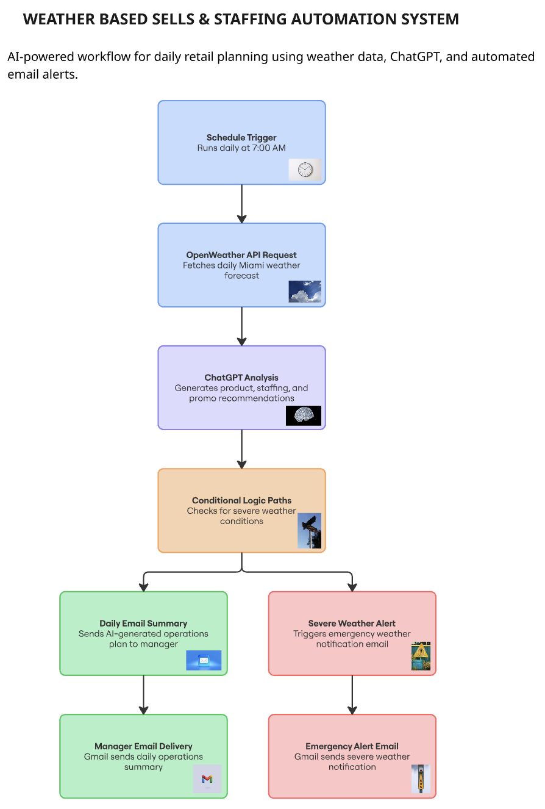
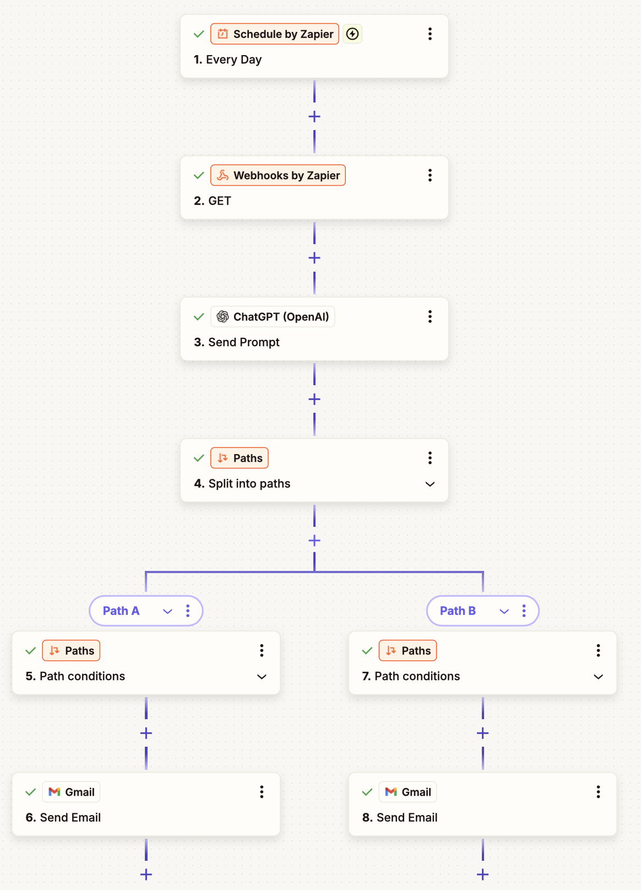
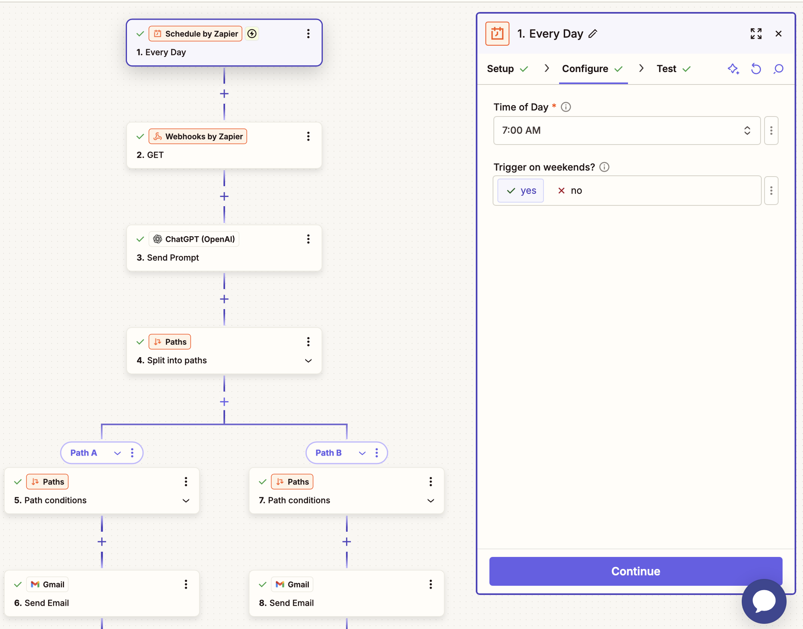
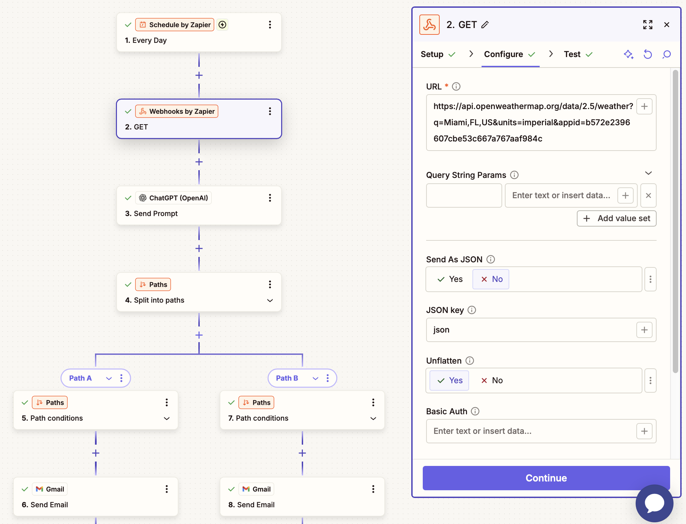
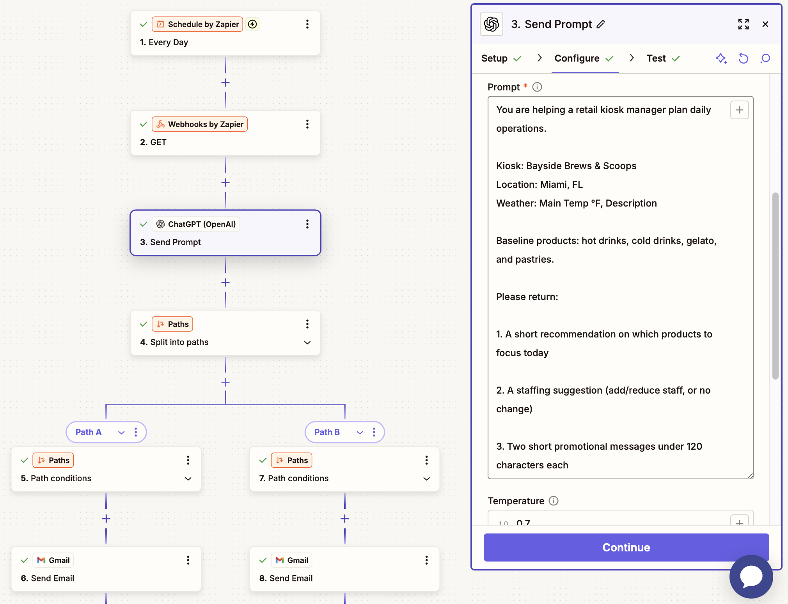
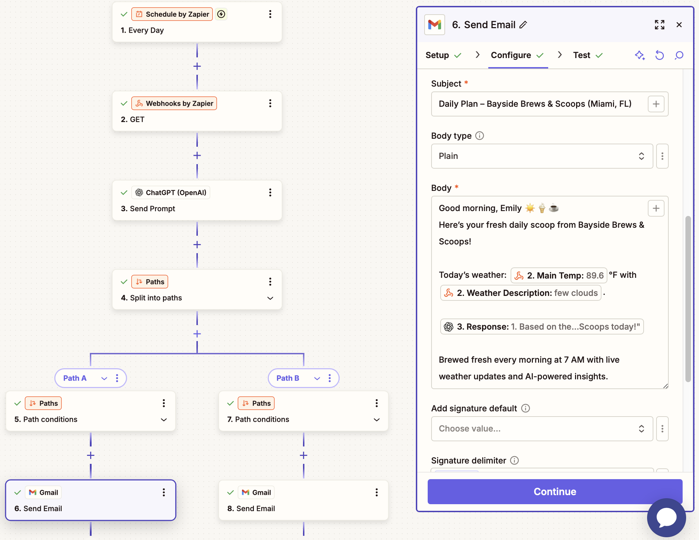
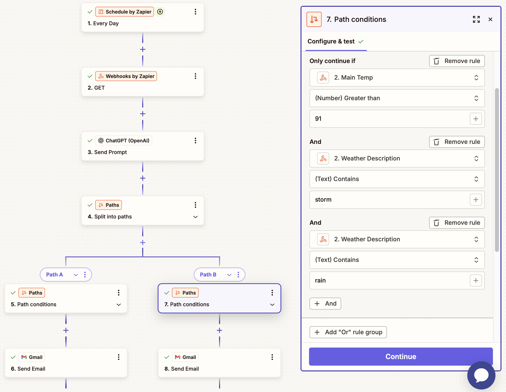
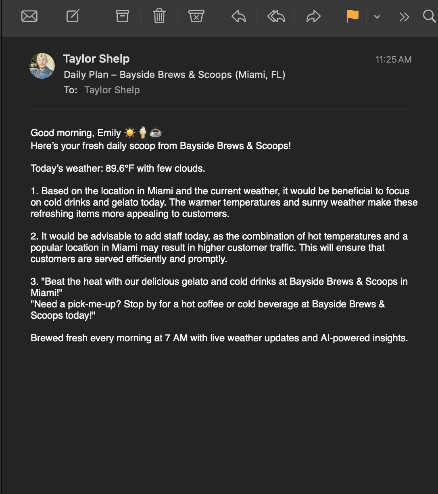
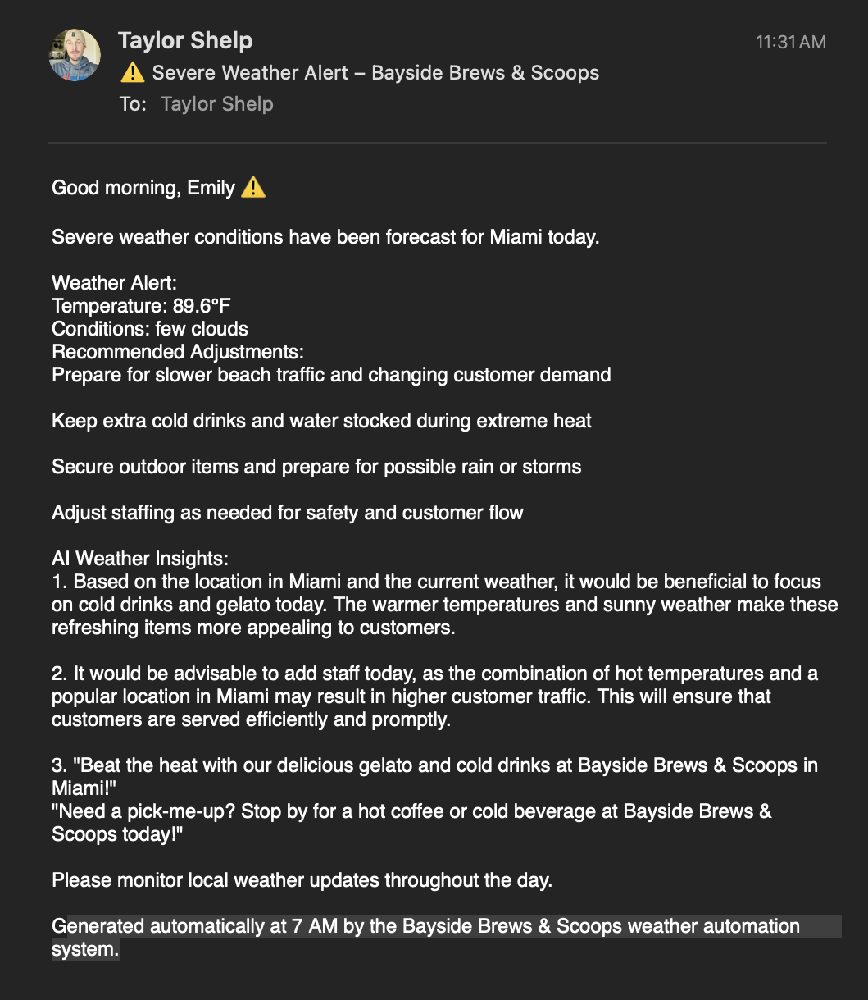

# Weather-Based Sales & Staffing Automation System

---

## Overview
This project is an AI-powered automation workflow that helps a beachside kiosk make daily sales, staffing, and promotional decisions based on weather conditions.

The workflow fetches the daily forecast for Miami, FL, sends the weather data to ChatGPT for analysis, and emails the kiosk manager a daily operations summary.

---

## Business Problem
Bayside Brews & Scoops operates a coffee and ice cream kiosk near the beach in Miami, Florida. Weather conditions directly impact customer traffic, product demand, and staffing needs.

The manager previously had to manually review forecasts and make operational decisions each morning, creating delays and inconsistent preparation.

---

## Solution
Built an automated workflow that:
- Retrieves weather data from the OpenWeather API
- Uses ChatGPT to generate operational recommendations
- Suggests product focus and staffing adjustments
- Creates weather-based promotional messages
- Sends a daily summary email to the kiosk manager
- Triggers severe weather alerts for extreme heat, heavy rain, or storms

---

## Workflow Breakdown
1. Zapier schedule trigger runs daily at 7:00 AM
2. Webhooks by Zapier sends a GET request to the OpenWeather API
3. Weather data is sent to ChatGPT
4. AI generates product, staffing, and promotional recommendations
5. Gmail sends a daily operations summary email
6. Severe weather conditions trigger an alert notification

---

## Value Added
- Reduced manual operational planning
- Improved preparation speed for daily business operations
- Automated weather-based sales and staffing recommendations
- Created scalable AI-assisted decision support workflow

---

## Tech Stack
- Zapier
- OpenWeather API
- ChatGPT
- Gmail
- Webhooks
- Prompt Engineering
- API Integration
- Workflow Automation

---

## Workflow Screenshots

### Workflow Architecture Diagram

### Full Zapier Workflow Overview

### Schedule Trigger

### OpenWeather API Integration

### ChatGPT Analysis Step

### Gmail Email Action

### Severe Weather Logic

### Daily Summary Email Output

### Severe Weather Alert Email

---

## Future Improvements
- Store recommendations in Google Sheets
- Add dashboard analytics
- Implement SMS notifications
- Connect sales data for forecasting insights
- Add historical weather and sales trend analysis

---

## Project Status
Completed as a functional automation workflow for AI-assisted retail operations planning.

---
